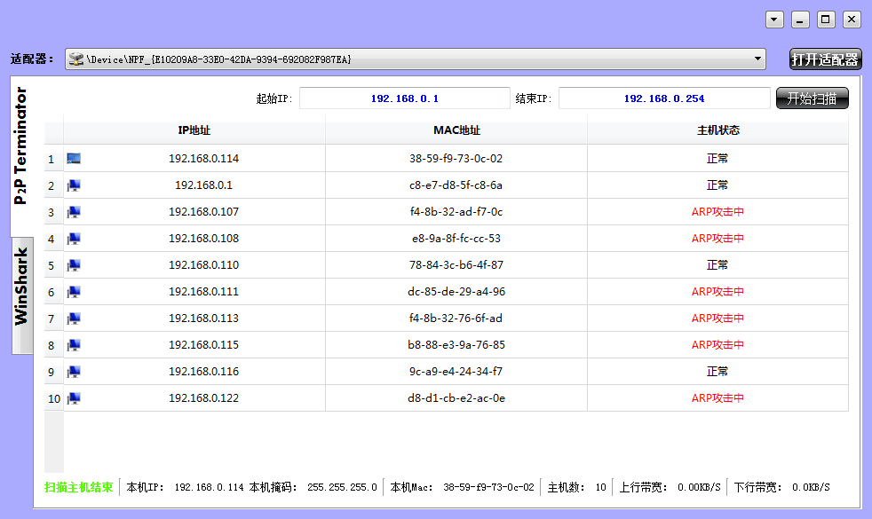

# SnifferToolServer
# 网络管理工具
&emsp;&emsp;The Sniffer Tool based on WinPcap and QT5.
&emsp;&emsp;基于WinPcap和QT5开发的网络管理工具。

# The Main Interface
# 主界面

# Functions
# 主功能

- Host Scan
- **主机扫描**
- ARP Attack
- **ARP 攻击**
- Packet Filter
- **过滤抓包**
- Traffic Statistic
- **实时网速，流量统计**
- Ping Function
- **Ping 功能**
- Port Scan 
- **端口扫描**

